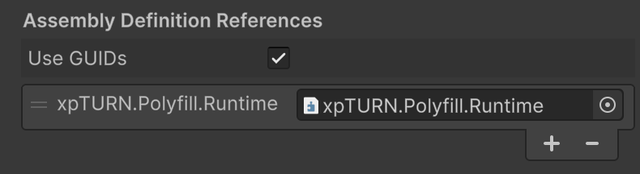

# xpTURN.Polyfill

[English](README.md) | [한국어](README.ko-KR.md) | **日本語** | [简体中文](README.zh-CN.md)

Unity プロジェクトで C# 9〜11 のコード（`record`、`init`、`required`、カスタム補間文字列ハンドラー、モジュール初期化子）、Unity 6000.5 以降の C# 12 属性、そしてその構文で書かれたオープンソースライブラリをコンパイルできるようにするパッケージです。

Unity は .NET Standard 2.1 を対象にコンパイルし、既定の言語バージョンは C# 9.0 です。そのため二つのものが欠けています。このパッケージは両方を補います。

- **Runtime**: コンパイラーが探す BCL 型（`IsExternalInit`、`RequiredMemberAttribute`、`InterpolatedStringHandlerAttribute` …）を、プロジェクトのすべてのアセンブリが使えるよう一度だけ public で宣言します。
- **Editor**: メニューコマンド一つで、Player ビルドと生成される `.csproj` ファイルに `-langversion:preview` を適用し、Unity と IDE が同じ構文を扱うようにします。

## なぜ必要か

### Unity が残した空白

[Unity マニュアル](https://docs.unity3d.com/6000.3/Documentation/Manual/csharp-compiler.html)は言語バージョンを C# 9.0 とし、*init only setters* と *module initializers* を未サポートの機能に挙げ、record については次のように案内しています。

> Users can work around this issue by declaring the `System.Runtime.CompilerServices.IsExternalInit` type in their own projects.

型がなければ、ビルドはコンパイルの段階で止まります。

| 書いたコード | 型がないときのコンパイルエラー |
|--------------|--------------------------------|
| `init`、`record`、`readonly record struct` | CS0518: Predefined type `System.Runtime.CompilerServices.IsExternalInit` is not defined or imported |
| `required` | CS0656: Missing compiler required member `RequiredMemberAttribute..ctor`（と `CompilerFeatureRequiredAttribute..ctor`） |
| `[InterpolatedStringHandler]`、`[CallerArgumentExpression]`、`[ModuleInitializer]`、`[SkipLocalsInit]`、`[DynamicallyAccessedMembers]` | CS0246: The type or namespace name could not be found（Unity 6000.6 は `[CallerArgumentExpression]` と `[DynamicallyAccessedMembers]` について、保護レベルのためアクセスできないという CS0122 を出します） |

生文字列リテラル、リストパターン、UTF-8 リテラル、file-scoped 名前空間は型を必要とせず、言語バージョンだけで動きます。言語バージョンは Editor コマンドが設定します。ただし MonoBehaviour クラスは file-scoped 名前空間に置かないでください（[理由](#unity-の-monobehaviour-と名前空間)）。`file` 型も型を必要としませんが、Unity 6000.3 以前のコンパイラーはこれを拒否します（CS0116）。Unity 6000.6 ではコンパイルできます。

### ライブラリのコピーはライブラリ自身しか使えない

人気のライブラリはすでにこの構文を使っています。それぞれが .NET Standard 2.1 アセンブリに同じ型の internal なコピーを埋め込んでいるため、コンパイルできています。

| NuGet パッケージ | 埋め込んだサポート型（確認した 12 個のうち） | 可視性 |
|------------------|--------------------------------------------|--------|
| ZLogger 2.5.10 | 12 | internal |
| Utf8StringInterpolation 1.3.1 | 11 | internal |
| R3 1.3.0 | 11 | internal |
| ZLinq 1.5.4 | 11 | internal |
| MemoryPack.Core 1.21.4 | 1（`IsExternalInit`） | internal |
| VitalRouter 2.2.0 | 0 | 該当なし |
| ZString 2.6.0 | 0 | 該当なし |

internal なコピーはライブラリをコンパイル可能にするだけで、あなたのアセンブリの役には立ちません。あなたのコードが record のコマンド、`required` メンバー、独自のハンドラーを宣言すると、コンパイラーは型をもう一度探し、見つけられません。

## 事例

### オープンソースライブラリを使う

各行は、ライブラリの README にあるコードをその NuGet パッケージでコンパイルした結果です。

| ライブラリ | README のコード | このパッケージなし | このパッケージあり |
|------------|-----------------|--------------------|--------------------|
| [ZLogger](https://github.com/Cysharp/ZLogger) 2.5.10 | `logger.ZLogInformation($"frame={frame} t={t:F2}")` | C# 9.0 で CS8773: *interpolated string handlers* is not available | C# 10 からエラー 0 |
| [VitalRouter](https://github.com/hadashiA/VitalRouter) 2.2.0 | `public readonly record struct MoveCommand(...) : ICommand;` | CS0518 | エラー 0 |
| [MemoryPack](https://github.com/Cysharp/MemoryPack) 1.21.4 | `required … { get; init; }` と `partial record` を使う `[MemoryPackable]` クラス | CS0518、CS0656 ×2 | エラー 0 |

- **ZLogger** に必要なのは言語バージョンだけです。ZLogger の Unity 向けガイドは、ZLogger を参照するすべての asmdef の隣に `csc.rsp` を置き、IDE 向けに `LangVersion.props` と CsprojModifier も使うよう求めています。このパッケージの Editor コマンドがその三つを置き換えます。
- **VitalRouter** は `readonly record struct` のコマンドを推奨していますが、`IsExternalInit` を同梱していないため、型が用意されるまで推奨の書き方がコンパイルできません。
- **MemoryPack** のモデルは `required` と `init` を使い、ジェネレーターがあなたのアセンブリに `scoped ref`（C# 11）を出力します。このパッケージの両方の部分が必要です。

### ライブラリの上に作る

- [xpTURN.XLogger](https://github.com/xpTURN/XLogger) は、リリースビルドから取り除ける `XLog*` メソッドで ZLogger をラップします。`[InterpolatedStringHandler]` のハンドラーを 7 個宣言し、`[CallerArgumentExpression]` と `[DynamicallyAccessedMembers]` で ZLogger の `AppendFormatted` シグネチャをなぞります。三つの型はすべてこのパッケージのものです。
- [xpTURN.XString](https://github.com/xpTURN/XString) は独自のハンドラーで、ZString の `Utf16ValueStringBuilder` の上に `XString.Format($"...")` を加えます。

### 依存を取り除く

[xpTURN.Klotho](https://github.com/xpTURN/Klotho) は ZLogger を、その依存グラフ（NuGet DLL 計 13 個）ごと取り除きました。独自のロガーは `ref struct` のハンドラー 6 個で `$"..."` の呼び出しスタイルを保っています。65 ファイルにわたる補間ログ呼び出しは 500 を超えます。ロギング用アセンブリが参照するのは `xpTURN.Polyfill.Runtime` だけです。

### ソースジェネレーターとモジュール初期化子

Klotho のソースジェネレーターは、コンポーネント、データアセット、そして他のアセンブリで宣言されたコマンドとメッセージのための `[ModuleInitializer]` 登録コードを出力し、手書きのリストなしでゲームの型が自分を登録するようにします。Unity はモジュール初期化子を未サポートとしており、MemoryPack の README は Unity ユーザーに union フォーマッターを手で登録するよう求めています。Klotho はこのパッケージの `ModuleInitializerAttribute` を使い、レジストリを最初に読む前に `RuntimeHelpers.RunModuleConstructor` でモジュールコンストラクターを自ら実行します。

### 自分たちのプロジェクトの前と後

| | 前（社内クライアント、2026 年 1 月） | 後（同じ VContainer + VitalRouter + ZLogger 構成のサンプル） |
|-|--------------------------------------|--------------------------------------------------------------|
| ビルドの言語バージョン | asmdef フォルダーごとに一つ、`csc.rsp` ファイル 6 個 | `csc.rsp` ファイル 0 個 |
| IDE の言語バージョン | `LangVersion.props` + `Directory.Build.props` + CsprojModifier | 自動 |
| サポート型 | プロジェクト専用 asmdef に手でコピーしたファイル 4 個 | パッケージ参照 |
| セットアップ | 新しい asmdef ごとに繰り返し | パッケージ 1 個、メニューコマンド 1 回 |

私たちの Unity プロジェクト 9 個が、Unity 2022.3.62f3、6000.3.9f1、6000.6.0f1 でこのパッケージを参照しています。

### 不要な場合

- コードが `init` や `record` を使わず C# 9 の範囲に収まり、プロジェクトのどのライブラリも呼び出し側に新しい構文を求めないとき。
- 新しい言語バージョンが必要なのが一つの asmdef だけで、型は不要なとき。その asmdef の隣の `csc.rsp` で足ります。
- static abstract インターフェースメンバーのように、ランタイムに依存する機能が必要なとき。どのポリフィルにも追加できません。

> 測定方法: [docs/Compatibility.md](./docs/Compatibility.md#case-studies)

## 他の選択肢との比較

.NET プロジェクト向けに書かれたポリフィルライブラリは、新しいコンパイラーと MSBuild プロパティを前提にしています。Unity にはどちらもありません。Unity は独自の Roslyn（2022.3 と 6000.3 は 4.3、6000.6 は 4.10）を固定して使い、MSBuild なしでビルドします。そのため同じライブラリでも、Unity の中では振る舞いが変わることがあります。

最後の列は、`-langversion:preview` を有効にした Unity 2022.3、6000.3、6000.6 で、型に依存する 12 の機能のうちどれがコンパイルできるかを示します: `init`、`record`、`readonly record struct`、`required`、`[SetsRequiredMembers]`、`[InterpolatedStringHandler]`、`[InterpolatedStringHandlerArgument]`、`[CallerArgumentExpression]`、`[SkipLocalsInit]`、`[ModuleInitializer]`、`[DynamicallyAccessedMembers]`、`[UnscopedRef]`（Roslyn 4.3 は無視するため 6000.6 のみ）。エディターごとの数、測定方法、ジェネレーターが失敗する理由: [docs/Compatibility.md](./docs/Compatibility.md#other-polyfill-libraries)

| 選択肢 | 形態 | 言語バージョンの設定 | コンパイルできる機能 |
|--------|------|----------------------|----------------------|
| ポリフィルなし | 該当なし | 該当なし | なし |
| **xpTURN.Polyfill 0.4.0** | UPM、共有アセンブリ一つ、public 型 | あり: ビルド、パッケージ、IDE | すべて |
| [PolySharp](https://github.com/Sergio0694/PolySharp) 1.15.0、1.16.0 | NuGet ソースジェネレーター、アセンブリごとの internal 型 | なし | `[DynamicallyAccessedMembers]` 以外すべて |
| `PolySharpIncludeRuntimeSupportedAttributes` を有効にした PolySharp 1.16.0 | 同上 | なし | なし（CS8336）。`.globalconfig` で埋め込み属性も無効にするとすべて |
| [PolyfillLib](https://github.com/SimonCropp/Polyfill) 11.4.1 | 依存 DLL 2 個を伴う NuGet DLL、public 型 | なし | すべて |
| [Polyfill](https://github.com/SimonCropp/Polyfill) 11.4.1（ソースのみ） | NuGet ソースファイル | なし | なし: C# 14 の構文 |
| [Meziantou.Polyfill](https://github.com/meziantou/Meziantou.Polyfill) 1.0.165 | NuGet ソースジェネレーター | なし | なし: 定義の重複、6000.6 では CS8336 |
| [ModernCSharpForUnity](https://github.com/iAcolyte/ModernCSharpForUnity) 0.1.0 | UPM ソースジェネレーター + Project Settings ページ | あり: `Assets` の asmdef ごとに `csc.rsp`、C# 9〜12 | 6000.6 のみで 12 個中 9 個。Roslyn 4.3 はジェネレーターを読み込まず（CS9057）、パッケージは Unity 6000.0 を要求します |
| [IsExternalInit](https://github.com/CorundumGames/IsExternalInit) 1.0.0 | OpenUPM DLL、public 型 | なし | `init`、`record`、`readonly record struct` |

このパッケージはジェネレーターを使わない素の C# ソースなので、Roslyn のバージョンに依存しません。だから一度の設定で 2022.3 から 6000.6 まで動きます。

他の選択肢が優れている点:

- ジェネレーターはアセンブリごとに独自の `internal` コピーを与えます。asmdef の参照が不要で、二つのコピーが衝突することもありません。
- PolySharp と PolyfillLib はトリミング用の注釈（`RequiresUnreferencedCode`、`DynamicDependency`）など、より多くの型を提供し、PolyfillLib は .NET Standard 2.1 にない BCL メソッドも追加します。Unity のコンパイラーと IDE はトリミング用の注釈を何にも使わないため、このパッケージには含めていません。
- ModernCSharpForUnity はプロジェクトごとに言語バージョンと nullable の設定を選べます。このパッケージが適用するのは `preview` だけです。

選ぶ前に知っておくべきこのパッケージの制約:

- 型は共有アセンブリに `public` で置かれるため、それを使う asmdef ごとに `xpTURN.Polyfill.Runtime` への参照が必要です。
- 同じ型を public で公開する二つ目のアセンブリを参照しないでください。このパッケージと public な `IsExternalInit` を宣言した DLL を併用すると、`init` が CS0518 で失敗します。そのとき Editor がそのアセンブリ名を警告で示します。
- 上の `.globalconfig` で二つのオプションを両方設定すれば、PolySharp 1.16.0 と並べてコンパイルできます。
- ランタイムにないものは、どのポリフィルにも追加できません: static abstract インターフェースメンバー（ジェネリック数学）、`ref` フィールド、インライン配列。

## 提供する型

| C# バージョン | 機能 | 型 |
|---------------|------|----|
| C# 9  | `init` 専用 setter | [IsExternalInit](./src/Polyfill/Assets/Polyfill/Runtime/Init/IsExternalInit.cs) |
| C# 9  | モジュール初期化子 | [ModuleInitializerAttribute](./src/Polyfill/Assets/Polyfill/Runtime/Module/ModuleInitializerAttribute.cs) |
| C# 9  | ローカル変数の初期化の省略 | [SkipLocalsInitAttribute](./src/Polyfill/Assets/Polyfill/Runtime/SkipLocalsInit/SkipLocalsInitAttribute.cs) |
| C# 9  | 動的にアクセスされるメンバー（トリマーの解析） | [DynamicallyAccessedMembersAttribute](./src/Polyfill/Assets/Polyfill/Runtime/CodeAnalysis/DynamicallyAccessedMembersAttribute.cs)、[DynamicallyAccessedMemberTypes](./src/Polyfill/Assets/Polyfill/Runtime/CodeAnalysis/DynamicallyAccessedMemberTypes.cs) |
| C# 9  | メソッドが設定するメンバーの nullable 解析 | [MemberNotNullAttribute](./src/Polyfill/Assets/Polyfill/Runtime/CodeAnalysis/MemberNotNullAttribute.cs)、[MemberNotNullWhenAttribute](./src/Polyfill/Assets/Polyfill/Runtime/CodeAnalysis/MemberNotNullWhenAttribute.cs) |
| C# 10 | カスタム補間文字列ハンドラー | [InterpolatedStringHandlerAttribute](./src/Polyfill/Assets/Polyfill/Runtime/InterpolatedString/InterpolatedStringHandlerAttribute.cs)、[InterpolatedStringHandlerArgumentAttribute](./src/Polyfill/Assets/Polyfill/Runtime/InterpolatedString/InterpolatedStringHandlerArgumentAttribute.cs) |
| C# 10 | 呼び出し元の引数式 | [CallerArgumentExpressionAttribute](./src/Polyfill/Assets/Polyfill/Runtime/Caller/CallerArgumentExpressionAttribute.cs) |
| C# 11 | `required` メンバー | [RequiredMemberAttribute](./src/Polyfill/Assets/Polyfill/Runtime/Required/RequiredMemberAttribute.cs) |
| C# 11 | `required` を満たすコンストラクター | [SetsRequiredMembersAttribute](./src/Polyfill/Assets/Polyfill/Runtime/Required/SetsRequiredMembersAttribute.cs) |
| C# 11 | コンパイラー機能の要求 | [CompilerFeatureRequiredAttribute](./src/Polyfill/Assets/Polyfill/Runtime/Required/CompilerFeatureRequiredAttribute.cs) |
| C# 11 | 構造体自身のフィールドへの `ref`（Unity 6000.5 以降。それ以前のコンパイラーは無視） | [UnscopedRefAttribute](./src/Polyfill/Assets/Polyfill/Runtime/CodeAnalysis/UnscopedRefAttribute.cs) |
| C# 12 | 独自の型のコレクション式（Unity 6000.5 以降） | [CollectionBuilderAttribute](./src/Polyfill/Assets/Polyfill/Runtime/Collections/CollectionBuilderAttribute.cs) |
| C# 12 | 実験的 API の診断（Unity 6000.5 以降） | [ExperimentalAttribute](./src/Polyfill/Assets/Polyfill/Runtime/CodeAnalysis/ExperimentalAttribute.cs) |
| IDE   | 文字列引数の言語（正規表現、JSON、日付書式） | [StringSyntaxAttribute](./src/Polyfill/Assets/Polyfill/Runtime/CodeAnalysis/StringSyntaxAttribute.cs) |

各型は、対象フレームワークにその型がないときだけコンパイルされます（`#if !NET5_0_OR_GREATER` など）。ランタイム自身の型があれば、そちらに譲ります。

### StringBuilder ヘルパー

`sb.AppendInterpolated($"…")` は、先に文字列を作らずに `AppendInterpolatedStringHandler` を通して追記します。

```csharp
using System.Globalization;
using System.Text;

var sb = new StringBuilder();
sb.AppendInterpolated($"frame={frame} t={t:F2} state={state}");
sb.AppendInterpolated(CultureInfo.InvariantCulture, $"{x:F3},{y:F3}");
```

整数、浮動小数点数、`decimal`、`bool`、`char`、`DateTime`、`DateTimeOffset`、`TimeSpan`、`Guid` はスタックバッファーに書式化され、書式なしまたは `G` の列挙値は初回使用時に作る名前テーブルから書き込まれます。これらの穴は割り当てを行いませんが、Unity の `TryFormat` の中に例外が二つあります。書式が `O` でも `R` でもない `DateTime` と `DateTimeOffset`（既定の書式も割り当てます）、そして `g` 書式の `TimeSpan` です。その他の型、列挙型のその他の書式、`ICustomFormatter` を返す provider、1024 文字を超える結果は、従来の `ToString` の経路を通ります。

| 書いたコード | Unity（このパッケージあり） | .NET 6 以降 |
|--------------|-----------------------------|-------------|
| `sb.Append($"…")` | 文字列を作ってから `Append(string)` を呼ぶ | BCL のハンドラー |
| `sb.AppendInterpolated($"…")` | このハンドラー | このパッケージなしではコンパイルできない |
| `sb.Append(provider, $"…")` | このハンドラー（拡張メソッド） | BCL のハンドラー（インスタンスメソッド） |

`sb.Append($"…")` はハンドラーを使えません。同じ名前ならインスタンスメソッドが常に拡張メソッドより優先されるためです。.NET 6 以降でもコンパイルするコードでは、`sb.Append(provider, $"…")` がどちらでも動きます。

## 要件

- Unity 2022.3.12f1 以降
- Unity 2022.3.62f3、6000.3.9f1、6000.6.0f1 で [tools/run-compat.sh](./tools/run-compat.sh) により検証済み。結果: [docs/Compatibility.md](./docs/Compatibility.md#version-matrix)

## インストール

1. **Window > Package Manager** を開きます。
2. **+** > **Add package from git URL...** をクリックします。
3. 次を入力します。

```text
https://github.com/xpTURN/Polyfill.git?path=src/Polyfill/Assets/Polyfill
```

特定のリリースに留めるには、タグを付けます。

```text
https://github.com/xpTURN/Polyfill.git?path=src/Polyfill/Assets/Polyfill#v0.4.0
```

### プロジェクト設定 (C# 言語バージョン)

C# 9 より新しい構文には、二か所で新しい言語バージョンが必要です。ビルドのための Unity のコンパイラー引数と、IDE のための生成された `.csproj` ファイルです。メニューコマンド一つで両方を設定します。

**Edit > Polyfill > Player Settings > Apply Additional Compiler Arguments -langversion (All Installed Platforms)**

このコマンドは次のことを行います。

- インストール済みのすべてのプラットフォームについて、Player 設定の **Additional Compiler Arguments** に `-langversion:preview` を追加します。Unity のコンパイラーはこの値を使います。
- 同じプラットフォームの **Scripting Define Symbols** に `CSHARP_PREVIEW` を追加し、コードで `#if CSHARP_PREVIEW` を確認できるようにします。
- `.csproj` ファイルを `<LangVersion>preview</LangVersion>` で再生成し、IDE（Visual Studio、Cursor、OmniSharp など）が同じ構文を読めるようにします。以後の再生成でも保たれます。

この選択は `ProjectSettings/xpTURN.Polyfill.Settings.json` に保存されます。asmdef の隣に [docs/csc.rsp](./docs/csc.rsp) のような `csc.rsp` ファイルを置く必要はありません。**Edit > Polyfill > Regenerate Project Files** でいつでも `.csproj` ファイルを書き直せます。

元に戻すには **Edit > Polyfill > Player Settings > Remove Additional Compiler Arguments -langversion (All Installed Platforms)** を実行します。

### `preview` が受け付ける構文

`preview` は、エディターに同梱されたコンパイラーの最も新しい言語バージョンを意味します。

| Unity | コンパイラー | `-langversion:preview` で使えるもの |
|-------|--------------|--------------------------------------|
| 2022.3、6000.3 | Roslyn 4.3 | C# 10、および `file` 型（CS0116）と `[UnscopedRef]`（無視されるため `ref` を返すと CS8170 で失敗）を除く C# 11。C# 12 は使えません。 |
| 6000.6 | Roslyn 4.10 | インライン配列を除く C# 12、および C# 13 の一部（`params` スパン、`\e`） |

Unity のリリースノートによると、6000.5 でコンパイラーが新しくなります。Roslyn 4.10 が必要なコード（C# 12、`file` 型、`[UnscopedRef]`）は `#if CSHARP_PREVIEW && UNITY_6000_5_OR_NEWER` で囲んでください。

落とし穴:

- この引数は `Library/PackageCache` のサードパーティ・Unity パッケージを含め、プロジェクトのすべてのアセンブリに適用されます。
- ジェネリック属性（`[MyAttribute<int>]`）は Roslyn 4.3 でコンパイルできますが、Unity 2022.3 と 6000.3 の IL2CPP ビルドを、属性名を示さない `InvalidCastException` で壊します。Unity 6000.6 はビルドできます。
- `ref` フィールドは Roslyn 4.3 でエラーなくコンパイルされますが、ランタイムがサポートしていません。Roslyn 4.10 は CS9064 を出します。
- static abstract インターフェースメンバー（CS8919）とメソッドに付けた `[AsyncMethodBuilder]`（CS0592）は、三つのエディターのどれでもコンパイルできません。

### Assembly Definition の使い方

プロジェクトで **Assembly Definition**（.asmdef）を使っている場合は、ポリフィルの型（`init`、`record`、`required`、補間文字列ハンドラーなど）を使うすべての asmdef に、このパッケージのランタイムアセンブリへの参照を追加してください。

1. **Assembly Definition**（.asmdef）ファイルを選択し、Inspector で開きます。
2. **References** で **+** をクリックし、**xpTURN.Polyfill.Runtime** を追加します。

この参照がないと、そのアセンブリのスクリプトから `IsExternalInit` や `RequiredMemberAttribute` などの型が見えず、コンパイルに失敗することがあります。

パッケージ参照を追加した後の状態:



## 使用例

### init 専用プロパティ (C# 9)

```csharp
public class Data
{
    public string Id { get; init; }
    public int Value { get; init; }
}

var d = new Data { Id = "a", Value = 1 };
```

### record (C# 9)

`init` のポリフィルの上で動きます。値の等価性と `with` 式をサポートします。

```csharp
public record Point(int X, int Y);

var p = new Point(1, 2);
var q = p with { Y = 3 };  // Point(1, 3)
```

### SkipLocalsInit (C# 9)

メソッドのローカル変数をゼロで埋めないようコンパイラーに指示し、ホットパスの大きな `stackalloc` バッファーで時間を節約します。すべての要素を読む前に書く場所でだけ使ってください。アセンブリが unsafe コードを許可している必要があります（asmdef の **Allow 'unsafe' Code**。なければ CS0227）が、メソッド自体に `unsafe` キーワードは不要です。

```csharp
using System;
using System.Runtime.CompilerServices;

[SkipLocalsInit]
static string ToHex(ReadOnlySpan<byte> data)
{
    Span<char> chars = data.Length <= 128 ? stackalloc char[data.Length * 2] : new char[data.Length * 2];
    for (int i = 0; i < data.Length; i++)
    {
        chars[i * 2] = "0123456789abcdef"[data[i] >> 4];      // どの文字も読む前に書く
        chars[i * 2 + 1] = "0123456789abcdef"[data[i] & 0xF];
    }
    return new string(chars);
}
```

### モジュール初期化子 (C# 9)

`[ModuleInitializer]` のメソッドは、誰も呼ばなくてもアセンブリごとに一度実行されます。ソースジェネレーターが出力する登録コードに向いています。`static` で、引数を取らず、`void` を返し、`internal` か `public` である必要があります（そうでなければ CS8814、CS8815）。

```csharp
using System.Runtime.CompilerServices;

static class CommandRegistration
{
    [ModuleInitializer]
    internal static void Register() => CommandRegistry.Add(typeof(MoveCommand));
}
```

メソッドがいつ実行されるかは、コードがどこで動くかによって変わります。

| どこで | モジュール初期化子が実行されるとき |
|--------|------------------------------------|
| エディター | ユーザーコードが動く前にすべて（`[InitializeOnLoad]` よりも前） |
| IL2CPP プレイヤー | 起動時にすべて |
| Mono プレイヤー | アセンブリが初めて使われたとき: 静的メソッドの呼び出し、静的フィールドの読み取り、オブジェクトのメソッド呼び出し。`typeof` だけでは実行されず、誰も触らないアセンブリでは最後まで実行されません。 |

- Mono プレイヤーで、他のアセンブリの登録に依存するコードは、先にそのアセンブリの初期化子を実行してください: `RuntimeHelpers.RunModuleConstructor(typeof(SomeTypeInThatAssembly).Module.ModuleHandle)`
- IL2CPP はこの呼び出しで `NotSupportedException` を投げるので、`try`/`catch` で囲んでください。IL2CPP では初期化子はすでに実行済みです。

### CallerArgumentExpression (C# 10)

コンパイラーが、指定したパラメーターに引数の**ソーステキスト**を渡します。アサーションや診断に便利です。

```csharp
using System.Runtime.CompilerServices;

static void Assert(bool condition, [CallerArgumentExpression(nameof(condition))] string expression = null)
{
    if (!condition)
        throw new System.ArgumentException($"Condition failed: {expression}");
}

Assert(x > 0);  // 失敗すると: "Condition failed: x > 0"
```

### カスタム補間文字列 (C# 10)

[InterpolatedStringHandlerAttribute](./src/Polyfill/Assets/Polyfill/Runtime/InterpolatedString/InterpolatedStringHandlerAttribute.cs) を使うと、メソッドは完成した `string` の代わりに、自分で書いた構造体として `$"…"` を受け取れます。コンパイラーがリテラルをその構造体への呼び出しに変換するので、テキストができる前にメソッドが何をするかを決められます。私たちのプロジェクトでは三通りに使っています。

| 用途 | `string` パラメーターではできないこと | 使っている場所 |
|------|---------------------------------------|----------------|
| 無効なログレベルを飛ばす | レベルが無効な間はテキストを作らず、`{…}` の式も実行せず、リリースビルドからは呼び出しを取り除く | [Klotho](https://github.com/xpTURN/Klotho) のロガー、[XLogger](https://github.com/xpTURN/XLogger) |
| 再利用バッファーに書く | 文字列を作らずに UI テキストを更新する | [XString](https://github.com/xpTURN/XString) `label.SetTextX($"…")` |
| 値に名前を付ける | 穴ごとに、その式の名前を付けたログフィールドにする | [ZLogger](https://github.com/Cysharp/ZLogger) 上の XLogger |

#### レベルが無効なら処理を省く

[InterpolatedStringHandlerArgumentAttribute](./src/Polyfill/Assets/Polyfill/Runtime/InterpolatedString/InterpolatedStringHandlerArgumentAttribute.cs) がロガーをハンドラーのコンストラクターに渡し、コンストラクターがメッセージを作るかどうかを答えます。

```csharp
using System.Runtime.CompilerServices;
using System.Text;
using UnityEngine;

[InterpolatedStringHandler]
public ref struct VerboseHandler
{
    readonly StringBuilder _sb;

    public VerboseHandler(int literalLength, int formattedCount, ILogger logger, out bool enabled)
    {
        enabled = logger.IsLogTypeAllowed(LogType.Log);
        _sb = enabled ? new StringBuilder(literalLength + formattedCount * 8) : null;
    }

    public void AppendLiteral(string value) => _sb.Append(value);
    public void AppendFormatted<T>(T value) => _sb.Append(value?.ToString());
    public string Text => _sb?.ToString();
}

public static class LoggerExtensions
{
    [System.Diagnostics.Conditional("DEBUG")]   // エディターと開発ビルド
    public static void Verbose(this ILogger logger,
        [InterpolatedStringHandlerArgument("logger")] ref VerboseHandler message)
    {
        if (message.Text is { } text) logger.Log(LogType.Log, text);
    }
}
```

呼び出しは一行のままです。

```csharp
Debug.unityLogger.Verbose($"tick={tick} state={DumpState()}");
```

コンパイラーが生成するコードはおおよそ次のとおりです。

```csharp
ILogger logger = Debug.unityLogger;
var message = new VerboseHandler(12, 2, logger, out bool enabled);
if (enabled)
{
    message.AppendLiteral("tick=");
    message.AppendFormatted(tick);
    message.AppendLiteral(" state=");
    message.AppendFormatted(DumpState());
}
LoggerExtensions.Verbose(logger, ref message);
```

- `Debug.unityLogger.filterLogType = LogType.Warning` のとき、この呼び出しはテキストを作らず、`DumpState()` も実行しません。`Debug.Log($"…")` は、Unity がフィルターを確認する前に文字列全体を作ります。
- リリースプレイヤーは `DEBUG` を定義しないので、コンパイラーは呼び出しをハンドラーと引数ごと取り除きます。
- Klotho のロガーは、レベルごとにハンドラーを一つ置いたこの形です。ハンドラーが数値を `TryFormat` でスレッドごとの `char[]` に書くので、数値と文字列であれば、有効な呼び出しでも割り当ては最後の文字列一つだけです。

#### 再利用バッファーに書く

[XString](https://github.com/xpTURN/XString) は ZString のプールされたバッファーに書式化し、その文字列を TextMesh Pro に渡すので、毎フレーム更新するラベルでも文字列を作りません。

```csharp
hpLabel.SetTextX($"HP {hp} / {maxHp}");
```

内部を簡略化すると:

```csharp
public static void SetTextX(this TMP_Text label, ref XStringHandler message)
{
    var chars = message.Builder.AsArraySegment();   // ZString Utf16ValueStringBuilder
    label.SetCharArray(chars.Array, chars.Offset, chars.Count);
    message.Builder.Dispose();                       // プールに戻す
}
```

#### 値に名前を付ける

`[CallerArgumentExpression]` はハンドラーの `AppendFormatted` でも動くので、穴ごとにそのソーステキストが一緒に届きます。XLogger はそれを ZLogger に渡し、ZLogger は構造化ログのフィールドとして書き出します。

```csharp
public void AppendFormatted<T>(T value, int alignment = 0, string format = null,
    [CallerArgumentExpression("value")] string argumentName = null)
    => _inner.AppendFormatted(value, alignment, format, argumentName);
```

```csharp
logger.XLogInformation($"Player {playerId} reached {score} points");   // argumentName: "playerId", "score"
```

#### 自作するとき

- コンストラクターは `(int literalLength, int formattedCount)` に続けて `[InterpolatedStringHandlerArgument]` に挙げたパラメーターを、必要ならその後に `out bool` を受け取ります。`AppendLiteral(string)` と、受け付ける穴の形（`{x}`、`{x:F2}`、`{x,8}`）ごとの `AppendFormatted` を用意してください。
- `ToString()` を呼ぶジェネリックな `AppendFormatted<T>(T value)` は値型の穴ごとに割り当てを行い、`value is IFormattable` はボックス化を加えます。穴ごとに割り当てが二回になり、そうした穴が二つあると素の `$"…"` より多くなります。ログに使う型のオーバーロードを追加して Klotho のように `TryFormat` で書式化するか、サンプルの [XHandler](./samples/PolyfillSample/Assets/Scripts/InterpolatedString/XHandler.cs) のように、穴をこのパッケージの `AppendInterpolatedStringHandler`（[StringBuilder ヘルパー](#stringbuilder-ヘルパー)）に渡してください。
- 静的フィールドに置いたバッファーは、穴の中で起きる入れ子の呼び出しに耐える必要があります。Klotho は使っている間、`[ThreadStatic]` のバッファーをフィールドから取り出しておきます。
- ハンドラーだけを受け取るメソッドは `$"…"` しか受け付けません。`logger.Verbose("tick=" + tick)` は CS1620（*must be passed with the 'ref' keyword*）で失敗しますが、このメッセージは理由を示しません。呼び出し側に必要なら `string` のオーバーロードを追加してください。
- `using UnityEngine;` と一緒に使うなら、`[System.Diagnostics.Conditional(...)]` は完全な名前で書いてください。`using System.Diagnostics;` を加えると `Debug` があいまいになります（CS0104）。
- そのまま使えるもの: ロギングなら [ZLogger](https://github.com/Cysharp/ZLogger) と [XLogger](https://github.com/xpTURN/XLogger)、文字列なら [ZString](https://github.com/Cysharp/ZString) と [XString](https://github.com/xpTURN/XString)。

### required メンバー (C# 11)

`required` メンバーはオブジェクト初期化子で設定しなければなりません。`[SetsRequiredMembers]` を付けたコンストラクターは自分で設定します。

```csharp
using System.Diagnostics.CodeAnalysis;

public class Config
{
    public required string Name { get; init; }
    public int Port { get; init; } = 7777;

    public Config() { }

    [SetsRequiredMembers]
    public Config(string name) => Name = name;
}

var a = new Config { Name = "lobby" };   // OK
var b = new Config("lobby");             // OK: コンストラクターが Name を設定する
var c = new Config { Port = 9000 };      // CS9035: required member 'Config.Name' must be set
```

### Unity の MonoBehaviour と名前空間

MonoBehaviour と ScriptableObject のクラスはブロック形式の名前空間で宣言してください。Unity はファイルを読んでスクリプトファイルとクラスを結び付けますが、Unity 2022.3、6000.3、6000.6 では file-scoped 名前空間（`namespace Game;`）だとこの結び付けに失敗します。`MonoScript.GetClass()` は null を返し、コンポーネントを追加すると *"Can't add script component 'Player' because the script class cannot be found"* と表示されます。

```csharp
using UnityEngine;

namespace Game
{
    public class Player : MonoBehaviour { }
}
```

ハンドラーやロガーなど、その他のクラスは file-scoped 名前空間を使ってかまいません。

## ライセンス

xpTURN.Polyfill のコードは Apache License, Version 2.0 の下で提供されます。詳しくは [LICENSE](./LICENSE) を参照してください。

## リンク

- **変更履歴**: [CHANGELOG](./CHANGELOG.md)
- **サンプル**: [samples/PolyfillSample](./samples/PolyfillSample) — このパッケージをパスで参照する Unity 2022.3 プロジェクト
- **ライセンス**: [LICENSE](./LICENSE)
- **作者**: [xpTURN](https://github.com/xpTURN)
