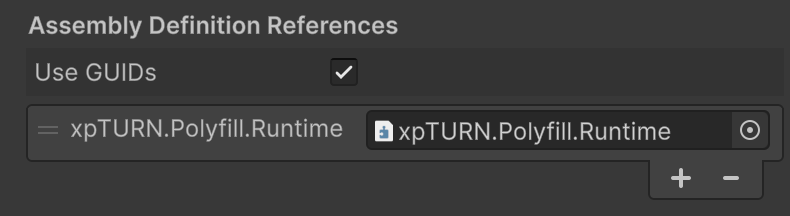

# xpTURN.Polyfill.Runtime

Runtime polyfill package for using C# 9·10·11 syntax (`record`, `init`, `required`, custom interpolated strings, etc.) in Unity as-is.

The .NET Standard 2.1 BCL used by Unity does not include the types required for the above syntax (`IsExternalInit`, `RequiredMemberAttribute`, etc.), so code generated by the compiler may fail to resolve them at runtime. This package provides the same namespace and type names for those APIs and, via its Editor module, supports applying `-langversion` in Player Settings and auto-configuring .csproj LangVersion.

## Provided types

| C# version | Feature | Types |
|------------|----------|--------|
| C# 9  | `init`-only setter | [IsExternalInit](./src/Polyfill/Assets/Polyfill/Runtime/Init/IsExternalInit.cs) |
| C# 9  | Skip locals init | [SkipLocalsInitAttribute](./src/Polyfill/Assets/Polyfill/Runtime/SkipLocalsInit/SkipLocalsInitAttribute.cs) |
| C# 10 | Custom interpolated string handler | [InterpolatedStringHandlerAttribute](./src/Polyfill/Assets/Polyfill/Runtime/InterpolatedString/InterpolatedStringHandlerAttribute.cs), [InterpolatedStringHandlerArgumentAttribute](./src/Polyfill/Assets/Polyfill/Runtime/InterpolatedString/InterpolatedStringHandlerArgumentAttribute.cs) |
| C# 10 | Caller expression argument | [CallerArgumentExpressionAttribute](./src/Polyfill/Assets/Polyfill/Runtime/Caller/CallerArgumentExpressionAttribute.cs) |
| C# 11 | `required` member | [RequiredMemberAttribute](./src/Polyfill/Assets/Polyfill/Runtime/Required/RequiredMemberAttribute.cs) |
| C# 11 | Constructor satisfying `required` | [SetsRequiredMembersAttribute](./src/Polyfill/Assets/Polyfill/Runtime/Required/SetsRequiredMembersAttribute.cs) |
| C# 11 | Compiler feature requirement | [CompilerFeatureRequiredAttribute](./src/Polyfill/Assets/Polyfill/Runtime/Required/CompilerFeatureRequiredAttribute.cs) |

Runtime also includes interpolated string helpers such as `AppendInterpolatedStringHandler` for `StringBuilder`.

## Requirements

- Unity 2022.3.12f1 or later

## Installation

1. Open **Window > Package Manager**
2. Click **+** > **Add package from git URL...**
3. Enter:

```text
https://github.com/xpTURN/Polyfill.git?path=src/Polyfill/Assets/Polyfill
```

### Project settings (C# langversion)

For C# 9–11 syntax you may need **Additional Compiler Arguments** and **.csproj LangVersion**. The package **Editor** provides menu items and .csproj post-processing to apply or remove them.

To enable:

1. Run **Edit > Polyfill > Player Settings > Apply Additional Compiler Arguments -langversion (All Installed Platforms)**.
2. Settings are stored in **ProjectSettings** / **xpTURN.Polyfill.Settings.json**.

When applied (Auto):

- **Project Settings (Player > Additional Compiler Arguments)**  
  `-langversion:preview` is added for installed platforms (used by Unity build).
- **.csproj**  
  When Unity regenerates .csproj files, `<LangVersion>preview</LangVersion>` is **automatically** inserted so IDEs (Cursor, Visual Studio, OmniSharp, etc.) use it for C# 11 syntax support.
- **Scripting Define Symbols (Player > Other Settings)**  
  `CSHARP_PREVIEW` is added so you can use `#if CSHARP_PREVIEW` for C# 9+ code.

- Note: For Unity 2022.3.12f1 or later, creating a [csc.rsp](./docs/csc.rsp) file is unnecessary.

To disable:

- Run **Edit > Polyfill > Player Settings > Remove Additional Compiler Arguments -langversion (All Installed Platforms)**.

### Assembly Definition usage

If your project uses **Assembly Definition** (.asmdef), add a reference to this package’s runtime assembly in any asmdef that uses the polyfill types (`init`, `record`, `required`, interpolated string handlers, etc.).

1. Select your **Assembly Definition** (.asmdef) file and open it in the Inspector.
2. Under **References**, click **+** and add **xpTURN.Polyfill.Runtime**.

Without this reference, scripts in that assembly will not see types such as `IsExternalInit` or `RequiredMemberAttribute` and may fail to compile.

Result after adding the package reference:



## Usage examples

### init-only property (C# 9)

```csharp
public class Data
{
    public string Id { get; init; }
    public int Value { get; init; }
}

var d = new Data { Id = "a", Value = 1 };
```

### record (C# 9)

Works on top of the `init` polyfill. Supports value equality and `with` expressions.

```csharp
public record Point(int X, int Y);

var p = new Point(1, 2);
var q = p with { Y = 3 };  // Point(1, 3)
```

### SkipLocalsInit (C# 9)

Applied to a method (or type/module) so the compiler does not zero-initialize locals. **Usable only in `unsafe` code.** Especially effective with `stackalloc`: large stack buffers are not zero-filled, saving that cost in hot paths. Use only when every local is definitely assigned before use.

```csharp
using System.Runtime.CompilerServices;

[SkipLocalsInit]
static unsafe void FillBuffer()
{
    Span<byte> buffer = stackalloc byte[256];
    // ... fill buffer; without SkipLocalsInit the 256 bytes would be zeroed first
}
```

### required member (C# 11)

```csharp
public class Config
{
    public required string Name { get; set; }
    public required int Port { get; init; }

    [SetsRequiredMembers]
    public Config(string name, int port)
    {
        Name = name;
        Port = port;
    }
}
```

### CallerArgumentExpression (C# 10)

The compiler passes the **source text** of the argument for the specified parameter. Useful for assertions or diagnostics.

```csharp
using System.Runtime.CompilerServices;

static void Assert(bool condition, [CallerArgumentExpression(nameof(condition))] string? expression = null)
{
    if (!condition)
        throw new System.ArgumentException($"Condition failed: {expression}");
}

Assert(x > 0);  // On failure: "Condition failed: x > 0"
```

### Custom interpolated string (C# 10)

Use [InterpolatedStringHandlerAttribute](./src/Polyfill/Assets/Polyfill/Runtime/InterpolatedString/InterpolatedStringHandlerAttribute.cs) and [InterpolatedStringHandlerArgumentAttribute](./src/Polyfill/Assets/Polyfill/Runtime/InterpolatedString/InterpolatedStringHandlerArgumentAttribute.cs) to implement custom handlers.

Handler example:

```csharp
using System;
using System.Text;
using System.Runtime.CompilerServices;

namespace xpTURN.Polyfill.Samples.InterpolatedStringHandler
{
    [InterpolatedStringHandler]
    public ref struct XHandler
    {
        private static readonly StringBuilder _sb = new StringBuilder();
        public string GetString() => _sb.ToString();

        public XHandler(int literalLength, int formattedCount) => _sb.Clear();

        public void AppendLiteral(string value) => _sb.Append(value);
        public void AppendFormatted<T>(T value) => _sb.Append(value != null ? value.ToString() : "");
        public void AppendFormatted(string value) => _sb.Append(value);
        public void AppendFormatted(object value, int alignment = 0, string format = null) => _sb.Append(value != null ? value.ToString() : "");
        public void AppendFormatted<T>(T value, string format) => _sb.Append(value is IFormattable f ? f.ToString(format, null) : (value?.ToString() ?? ""));
    }
}
```

Logger example:

```csharp
using System;
using System.Text;
using System.Runtime.CompilerServices;

using UnityEngine;

using xpTURN.Polyfill.Samples.InterpolatedStringHandler;

namespace xpTURN.Polyfill.Samples;

public sealed class XLogger
{
    public static void Log([InterpolatedStringHandlerArgument] ref XHandler handler) =>
        Debug.Log(handler.GetString());

    public static void LogWarning([InterpolatedStringHandlerArgument] ref XHandler handler) =>
        Debug.LogWarning(handler.GetString());

    public static void LogError([InterpolatedStringHandlerArgument] ref XHandler handler) =>
        Debug.LogError(handler.GetString());

    public static void LogAssertion([InterpolatedStringHandlerArgument] ref XHandler handler) =>
        Debug.LogAssertion(handler.GetString());
}
```

Logger call:

```csharp
XLogger.Log($"Interpolated at time={Time.time:F2}, frame={Time.frameCount}");
```

Compiled result (ILSpy):

```csharp
XHandler handler = new XHandler(29, 2);
handler.AppendLiteral("Interpolated at time=");
handler.AppendFormatted(Time.time, "F2");
handler.AppendLiteral(", frame=");
handler.AppendFormatted(Time.frameCount);
XLogger.Log(ref handler);
```

- With the **above** compiled pattern, **runtime cost** and **GC** for interpolated strings are reduced.  
  Normal `$"…"` can allocate intermediate strings multiple times via `string.Format`/concatenation, and arguments passed as `params object[]` can **box** value types.  
  A custom handler is invoked generically as `AppendFormatted<T>(T value)`, so value types are passed without boxing; it appends literals and values in sequence (typically as a `ref struct`) and builds the final string only once at `Debug.Log(handler.GetString())`, keeping allocations and GC pressure low.

- The sample above is a minimal C# 10 custom interpolated string handler. For production, consider [ZLogger](https://github.com/Cysharp/ZLogger) or [ZString](https://github.com/Cysharp/ZString) on GitHub.

### MonoBehaviour and namespace in Unity

Use **block namespace** for MonoBehaviour scripts that are attached as components.  
With **file-scoped namespace** (`namespace xpTURN.Polyfill.Samples;`), Unity may fail to find the script class and show *"Can't add script component 'XXX' because the script class cannot be found"*.

- **Recommended (block)**  
  `namespace xpTURN.Polyfill.Samples { public class TestLogger : MonoBehaviour { ... } }`
- **Not recommended (file-scoped)**  
  `namespace xpTURN.Polyfill.Samples;` + `public class TestLogger : MonoBehaviour { ... }` — may not be recognized as a component

Plain classes (e.g. Config, XLogger) may use file-scoped namespace.

## License

The xpTURN.Polyfill code is under the Apache License, Version 2.0. See [LICENSE](./LICENSE.md) for details.

## Links

- **Changelog**: [CHANGELOG](./CHANGELOG.md)
- **License**: [LICENSE](./LICENSE.md)
- **Author**: [xpTURN](https://github.com/xpTURN)
